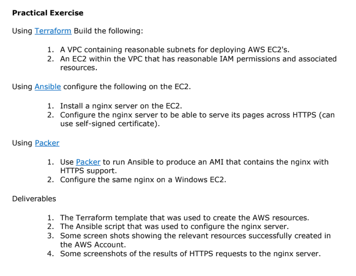
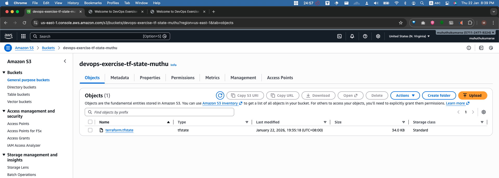
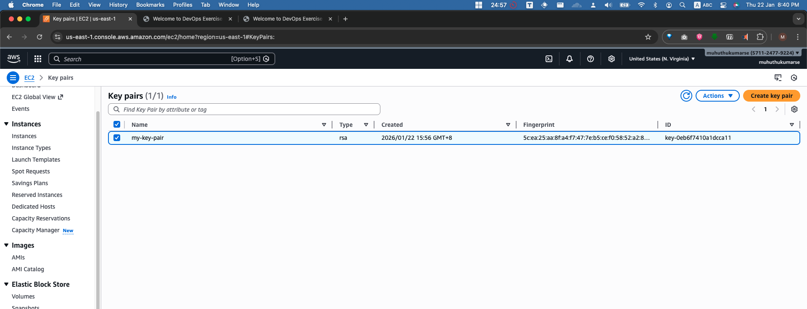
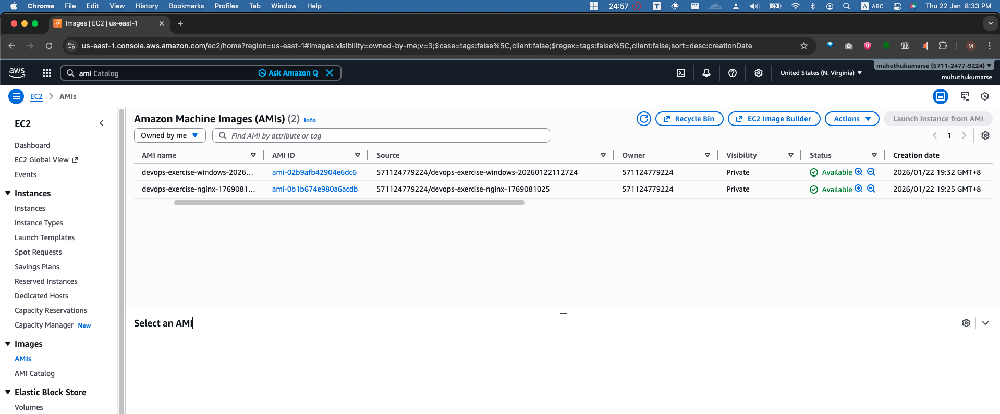
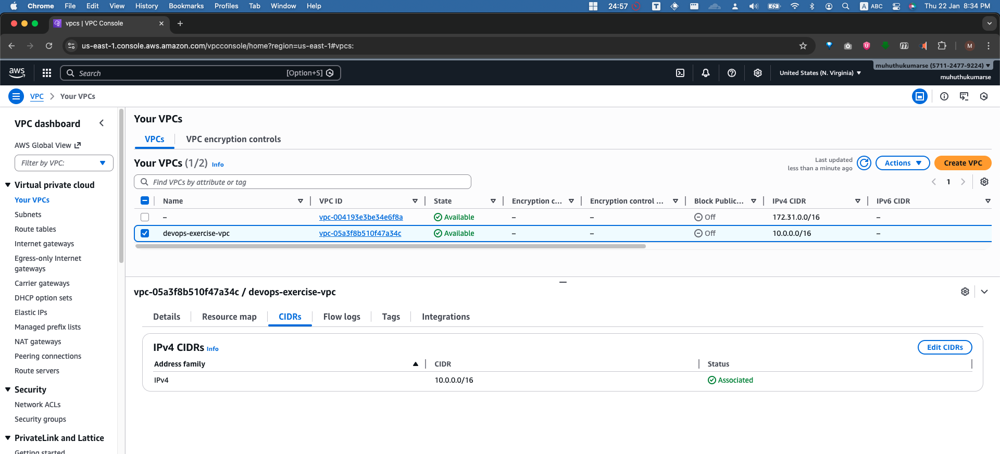
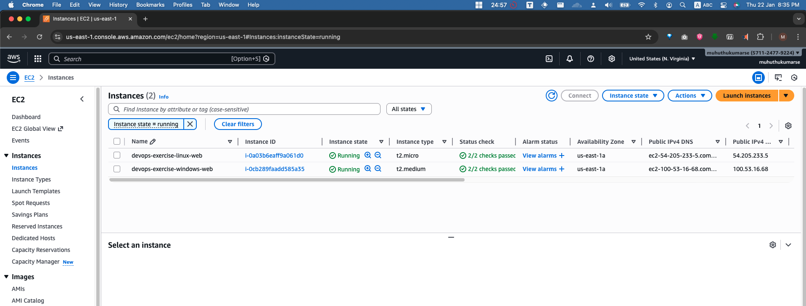
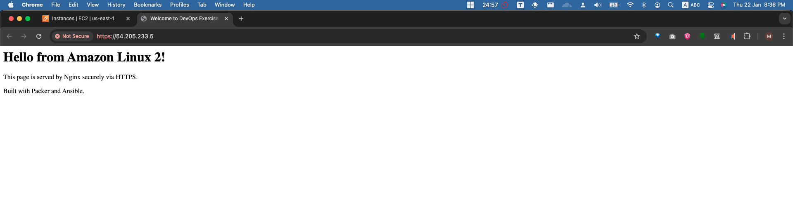
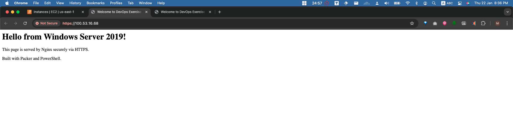
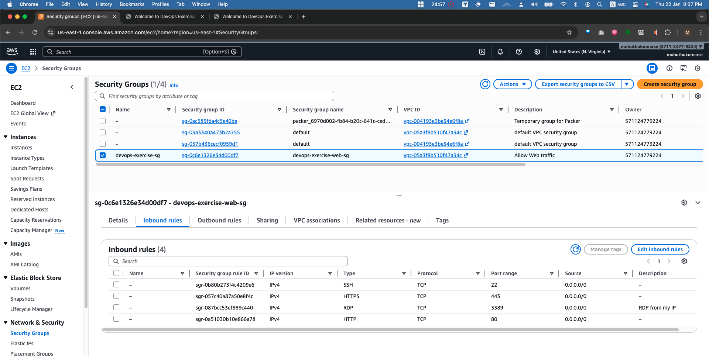
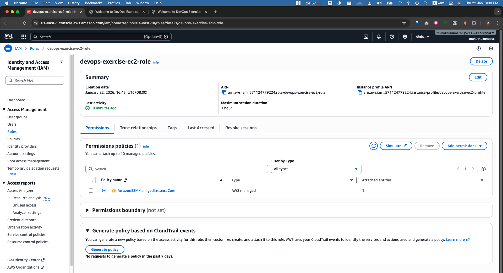

# DevOps Take-Home Test - Nginx Infrastructure

- **Author**: Muthukumar Selvarasu
- **Date**: 2026-01-22
- **Environment**: AWS

## 1. Project Requirements Mapping
This section maps the take-home test requirements to their specific implementation in this repository.



| **Requirement** | **Implementation Status** | **Location** |
| :--- | :--- | :--- |
| **Terraform**: Build VPC & Subnets | ✅ Completed | `terraform/networking.tf` |
| **Terraform**: Build EC2 with IAM | ✅ Completed | `terraform/compute.tf` |
| **Ansible**: Install Nginx + HTTPS | ✅ Completed | `ansible/playbook.yml` |
| **Packer**: Linux AMI (w/ Ansible) | ✅ Completed | `packer/aws-linux-nginx.pkr.hcl` |
| **Packer**: Windows AMI (w/ Nginx) | ✅ Completed | `packer/windows-nginx.pkr.hcl` |

---

## 2. Executive Summary
This repository contains the infrastructure automation for deploying an Nginx web server on both Amazon Linux 2 and Windows Server 2019 using Packer, Terraform, Ansible, and GitHub Actions.

This document serves as both the project documentation and the verification report confirming the successful deployment of the secure, dual-platform infrastructure.

---

## 2. Prerequisites (Manual Setup)

Before running the pipeline, you must manually set up the following in your AWS Account (`us-east-1`):

### 2.1 Create S3 Bucket for Terraform State
Create an S3 bucket to store the Terraform state file.
- **Bucket Name**: `devops-exercise-tf-state-<your-name>` (Update `terraform/providers.tf` if different).
- **Region**: `us-east-1`.
- **Versioning**: Enabled (Recommended).

### 2.2 Create EC2 Key Pair
Create a key pair to access the instances (SSH/RDP).
- **Name**: `my-key-pair`
- **Type**: RSA
- **Format**: `.pem`
- **Action**: Download the `.pem` file to your local machine. You will need this to decrypt the Windows Administrator password.

---

## 3. Project Structure
```
├── .github/
│   └── workflows/
│       ├── create.yml      # CI/CD: Build and Deploy Infrastructure
│       └── destroy.yml     # CI/CD: Destroy Infrastructure
├── ansible/
│   ├── playbook.yml        # Ansible: Linux Nginx Installation
│   └── templates/
│       └── nginx.conf.j2   # Ansible: Nginx Config Template
├── packer/
│   ├── aws-linux-nginx.pkr.hcl  # Packer: Linux AMI Template
│   ├── windows-nginx.pkr.hcl    # Packer: Windows AMI Template
│   ├── variables.pkr.hcl        # Packer: Common Variables
│   ├── plugins.pkr.hcl          # Packer: Plugin Requirements
│   └── bootstrap_winrm.txt      # Packer: WinRM Bootstrap Script
├── terraform/
│   ├── compute.tf          # TF: EC2, SG, IAM
│   ├── networking.tf       # TF: VPC, Subnets, IGW, Routes
│   ├── variables.tf        # TF: Input Variables
│   ├── outputs.tf          # TF: Output Values
│   ├── providers.tf        # TF: AWS Provider & State Config
│   └── windows_user_data.txt # TF: Windows Boot Script (User Data)
├── windows/
│   ├── install_nginx.ps1   # Windows: Setup Script (Nginx, SSM, Firewall)
│   ├── nginx.conf          # Windows: Nginx Configuration
│   ├── nginx.crt           # Windows: SSL Certificate (Local)
│   └── nginx.key           # Windows: SSL Key (Local)
├── scripts/
│   └── validate_local.sh   # Utility: Local Validation Script
├── .gitignore              # Git: Ignored Files
├── docs/                   # Evidence: Screenshots for Verification
└── README.md               # Doc: Project Documentation
```

---

## 4. Architectural Decisions

### Windows Strategy
1.  **Local SSL Certificates**: 
    - We generate self-signed certificates locally and upload them to the Windows AMI during the Packer build.
    - *Why?* Installing OpenSSL via Chocolatey on Windows proved unreliable due to frequent CDN timeouts (504/503 errors).
2.  **SSM over RDP**: 
    - We prioritize AWS Systems Manager (SSM) for management. Use `Session Manager` in the AWS Console to connect.
    - *Why?* More secure than opening RDP (Port 3389) to the world. RDP is restricted to your specific IP.
3.  **IIS vs Nginx**: 
    - We explicitly disable the Windows `W3SVC` (IIS) service at boot.
    - *Why?* Sysprep often re-enables IIS, which grabs Port 80 and prevents Nginx from starting.
4.  **User Data Scheduling**: 
    - We explicitly schedule `InitializeInstance.ps1` to run checking User Data on the next boot.
    - *Why?* Ensures the SSM Agent is correctly started and registered when a new instance launches from the AMI.

---

## 5. Pipelines (GitHub Actions)

### 5.1 Create Infra - Build AMI & Deploy
This workflow builds the custom AMIs (Linux & Windows) and deploys the infrastructure.
- **Trigger**: Go to **Actions** -> **Create Infra - Build AMI & Deploy** -> **Run workflow**.
- **Inputs**:
    - **Build Linux & Windows AMI ?**: Select `Yes` to build fresh AMIs.
    - **Deploy Nginx Web Server ?**: Select `Yes` to deploy with Terraform.

### 5.2 Destroy Infra
Destroys all infrastructure to clean up.

---

## 6. Accessing the Servers

### Linux
- **Connect**: Use Session Manager (AWS Console) OR SSH.
- **SSH Command**: `ssh -i my-key-pair.pem ec2-user@<public-ip>`
- **Verify**: Open `http://<public-ip>` in your browser.

### Windows
- **Connect**: Use Session Manager (AWS Console).
- **RDP Access**: Allowed only from your IP (configured in `terraform/compute.tf`).
    - **Username**: `Administrator`
    - **Password**: Decrypt using the `my-key-pair.pem` file in AWS Console.
- **Verify**: Open `http://<public-ip>` in your browser.

---

## 7. Deployment Verification Report (Evidence)

The following sections confirm the successful deployment of the infrastructure.

### 7.1 Prerequisites Verification
Before automation ran, the following manual resources were confirmed:

#### Evidence: S3 Backend & Key Pair
- **S3 Bucket**: `devops-exercise-tf-state-*` for state storage.


- **Key Pair**: `my-key-pair` for EC2 access.


### 7.2 Artifacts Generated
Immutable artifacts built using Packer:

| OS | AMI Name | Base Image | Key Software |
| :--- | :--- | :--- | :--- |
| **Linux** | `devops-exercise-nginx-*` | Amazon Linux 2 | Nginx, Python 3.8 |
| **Windows** | `devops-exercise-windows-*` | Windows Server 2019 | Nginx, SSM Agent |

#### Evidence: AMI Console

*(Place screenshot of AWS EC2 > AMIs verifying both images exist)*

### 7.2 Infrastructure Resources

#### Network Topology
- **VPC**: `devops-exercise-vpc` (10.0.0.0/16)
- **Subnets**: Public (10.0.1.0/24) & Private (10.0.2.0/24)
- **Security**: Port 80/443 (Global), Port 22/3389 (Restricted)

#### Evidence: VPC Dashboard

*(Place screenshot of VPC verification)*

#### Compute Instances
Two EC2 instances are currently running and serving traffic.

| Name | ID | Public IP | Status |
| :--- | :--- | :--- | :--- |
| `devops-exercise-linux-web` | `i-xxxxxxxx` | `x.x.x.x` | Running |
| `devops-exercise-windows-web` | `i-xxxxxxxx` | `x.x.x.x` | Running |

#### Evidence: EC2 Instances

*(Place screenshot of AWS EC2 > Instances)*

### 7.3 Validation

#### Web Accessibility
Nginx is successfully serving the custom landing page on both platforms.

**Linux Verification**:


**Windows Verification**:


#### Security Group Rules
Firewall rules are correctly applied, allowing web traffic while restricting management ports.

#### Evidence: Security Group Rules

*(Place screenshot of the `devops-exercise-web-sg` inbound rules)*

### 7.4 IAM & Permissions
The EC2 instances are assigned an IAM Role `devops-exercise-ec2-role` with `AmazonSSMManagedInstanceCore` policy attached, enabling Session Manager access.

#### Evidence: IAM Role

*(Screenshot of the IAM Role and attached policies)*
